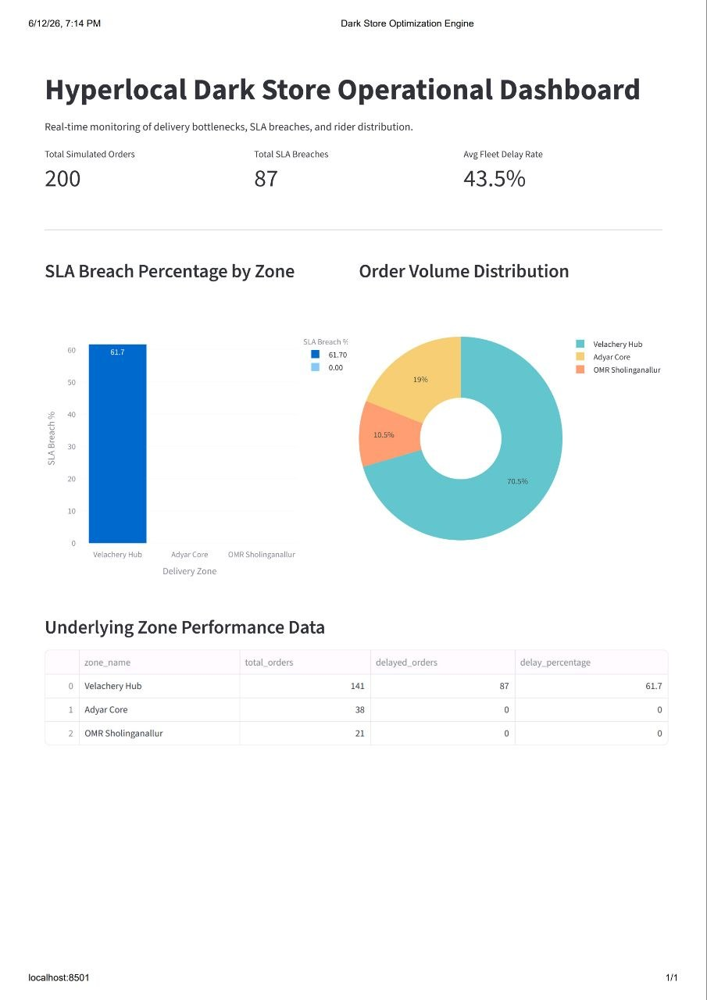

# Hyperlocal Dark Store Optimization Engine (HDSOE)

An automated analytics and real-time operational dashboard designed to monitor hyperlocal delivery performance, isolate delivery bottlenecks, track SLA breaches, and manage rider distribution across key urban zones.

---

## Project Overview

This project simulates real-time hyperlocal order operations across multiple dark stores and delivery hubs. It extracts and analyzes underlying performance metrics using a custom SQL analytical engine and surfaces these insights on an interactive web dashboard. 

### Key Features
* **Database Schema (`HDSOE_01_schema.sql`)**: Star-schema architecture with optimized dimensions (`dim_store`, `dim_zone`, `dim_rider`) and indexing on high-frequency foreign keys for swift query resolution.
* **Automated Data Pipeline (`HDSOE_03_data_loader.py`)**: Custom Python script generating weighted, realistic operational telemetry (including systematic delivery delays in high-demand tiers).
* **Analytical Processing (`HDSOE_02_analytics.sql`)**: Live aggregation of SLA breach rates and fleet performance directly from the data layer.
* **Interactive UI (`HDSOE_04_dashboard.py`)**: A Streamlit web dashboard visualization mapping volumetric distribution and operational risk zones.

---

## Tech Stack

* **Database:** MySQL (v8.0+)
* **Backend & Processing:** Python 3.x, `mysql-connector-python`
* **Data Visualization:** Streamlit, Pandas, Plotly Express

---

## Dashboard Preview

Once launched, the web application processes and renders critical delivery operations dynamically. Below is the interface capture of the live execution state:



---

## Core Metrics Monitored

* **Total Simulated Orders:** Scalable high-volume transactional count tracking overall platform demand.
* **Total SLA Breaches:** Real-time counter capturing delivery times exceeding target thresholds.
* **Avg Fleet Delay Rate:** Aggregate percentage indicating overall dispatch and delivery latency.
* **SLA Breach Percentage by Zone:** Bar graph isolating localized real-time delivery bottleneck risks (e.g., Velachery Hub).
* **Order Volume Distribution:** Holistic overview detailing localized market share performance per node.

---

## File Architecture

The project components are organized sequentially as follows:

```text
Hyperlocal-Dark-Store-Optimization-Engine/
├── HDSOE_01_schema.sql                       # Database and table initialization
├── HDSOE_02_analytics.sql                    # SQL core performance queries
├── HDSOE_03_data_loader.py                   # Automated data simulator & loader
├── HDSOE_04_dashboard.py                     # Streamlit frontend app
└── HDSOE_delivery_analytics_dashboard_preview.png # Dashboard user interface preview


======================================================================================

Setup & Execution Guide
1. Database Initialization
Ensure your MySQL server is running. Create the database schema and structures by running:

Bash
mysql -u root -p < HDSOE_01_schema.sql
2. Install Python Dependencies
Install the required packages using pip:

Bash
pip install mysql-connector-python pandas streamlit plotly
3. Run the Data Pipeline
Execute the synthetic data engine to populate your tables with real-time operational metrics:

Bash
python HDSOE_03_data_loader.py
4. Launch the Dashboard
Fire up the local Streamlit server to visualize your operational metrics:

Bash
streamlit run HDSOE_04_dashboard.py
